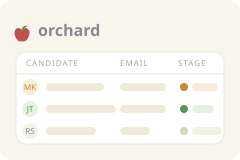

  

# Orchard

  

Didn't work? Create a Minds workspace and paste this to your agent:
` /use-template https://github.com/imbue-ai/orchard-mind-template`

## Why you care

Reaching out to a list of candidates by hand -- tracking who you've contacted,
writing the same email over and over with small tweaks, and never knowing
whether anyone actually opened it -- doesn't scale past a handful of people.
Orchard is a single board that runs the whole cold-outreach loop: a candidate
pipeline, templated emails sent from your own (and your teammates') Gmail,
and open-tracking so you know what landed.

## How to use it

Open the tab and you'll see an empty candidate table. From there:

- **Add a candidate** -- name, LinkedIn URL, company, role. "Find email" looks
  up their address from the LinkedIn URL via ContactOut, if you've added a
  token in Settings.
- **Write (or AI-draft) a template** -- reusable subject/body with
  `{{first_name}}` / `{{company}}` / `{{role}}` / `{{sender_name}}` tokens
  filled in per candidate. Paste writing samples into the voices panel and
  Claude can draft a template that sounds like you (or a teammate).
- **Compose and send** -- pick a candidate, a template, and which of your
  three inboxes to send from; the live preview shows exactly what they'll get
  before you send it through Gmail.
- **Watch the pipeline move** -- a candidate advances from "not contacted" to
  "reached out" to "replied" automatically as you send and as replies come in;
  an invisible tracking pixel raises a notification the moment someone opens
  your email.

## Ideas for making it yours

- Swap the example teammate inboxes ("Alex", "Sam") for your actual
  colleagues, so all three sending identities are real.
- Replace the two seed templates with the outreach copy you actually use.
- Paste in real writing samples for each sender so the AI voice-drafting
  sounds like the people actually sending the mail, not a generic recruiter.
- Add your own pitch ideas (what makes your company worth joining) and let
  Claude turn them into a template.
- Swap the Cloudflare quick tunnel for a named tunnel on your own domain if
  you want tracking links that don't rotate on every restart.

## What this is

This repository is a published **minds template**: a clean, bootable
snapshot of what a mind built, ready to adapt into your own. It is NOT the
generic workspace template -- it is this specific project.

[`template.md`](template.md) is the full manifest -- what it is, how it
works, what it needs to run, and what to adapt -- with the
machine-readable half (recipe, requirements, and the environment it needs
installed) in [`template.toml`](template.toml).
